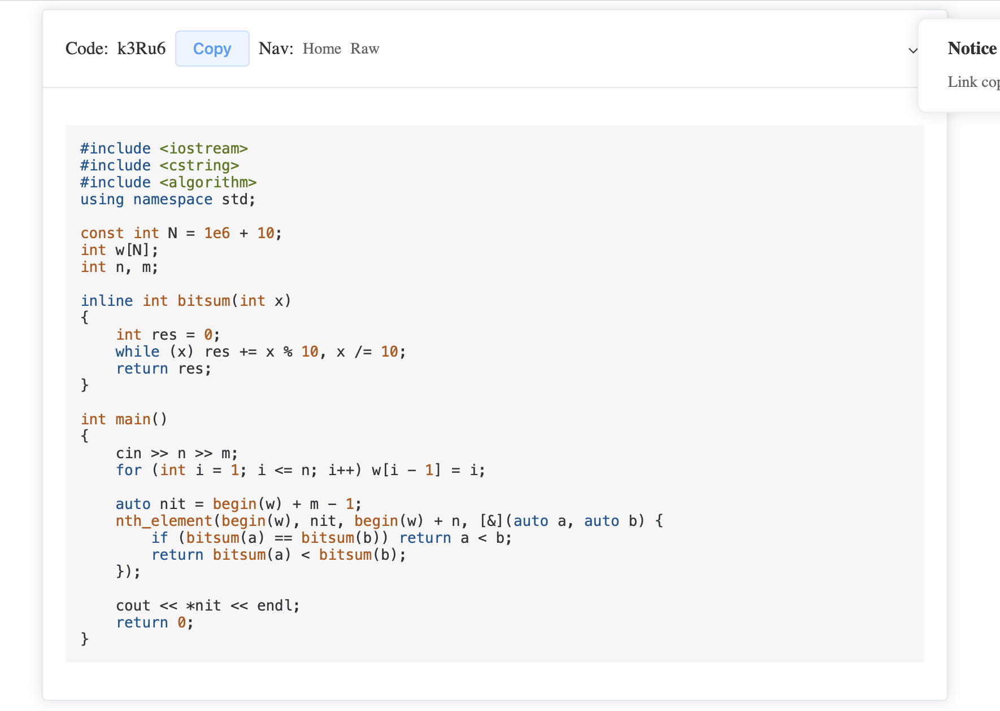

# sc-worker

This is a simple shortcut service based on cloudflare pages、functions and KV

Example site: https://sc.tisato.live

Just for exploring the usage of cloudflare pages functions.

## Usage

- Clone this project
- Edit `src/global.js` and `functions/[route].ts`
- `yarn build`
- Setup your KV on cloudflare
- `wrangler pages publish dist`